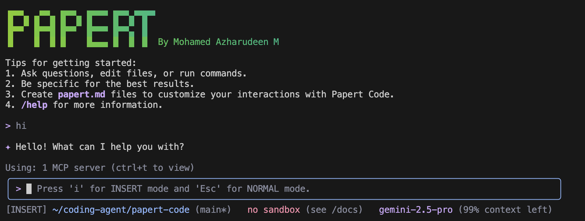
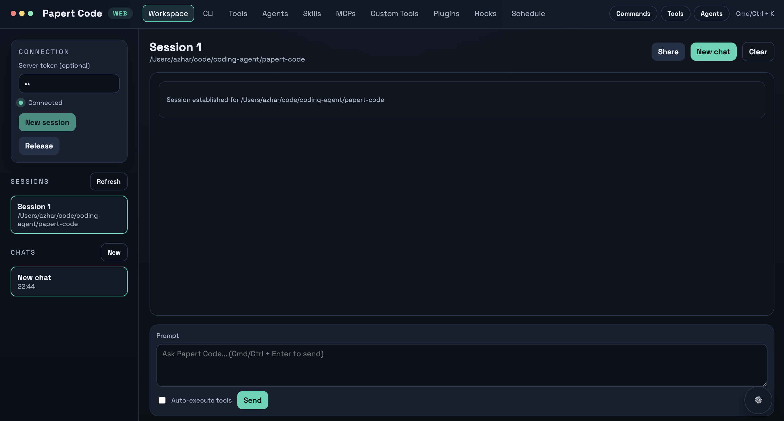

# Papert Code

Papert Code is an AI agent engine for software engineering workflows. It plans, reads, edits, and generates code across large repositories, executes shell and tool actions with safety controls, and exposes the same agent runtime through TypeScript and Python SDKs plus a VS Code companion extension.

- Terminal-first agent with `papert`, built for high-signal, multi-turn coding sessions.
- Codebase-aware tools: reads and edits files, runs ripgrep queries, executes shell commands, and respects `.gitignore` + `.papertignore`.
- Safety and control: structured plans, explicit approval modes (`plan`, `default`, `auto-edit`, `yolo`), and sandbox support (Seatbelt/macOS, Docker, Podman).
- Extensible platform: user commands, subagents, Model Context Protocol (MCP) servers, and TypeScript/Python SDKs for embedding Papert Code into your own apps.
- Works with any OpenAI-compatible API; pick your own model, base URL, and keys.

## Repository layout

- `packages/cli` — the Papert Code CLI (interactive TUI, tools, settings, sandbox integration).
- `packages/core` — core tool implementations, MCP plumbing, and shared services.
- `packages/sdk-typescript` — programmatic TypeScript SDK (streaming queries, reusable sessions, full CLI runner).
- `packages/sdk-python` — programmatic Python SDK (streaming queries, reusable sessions, control APIs).
- `packages/test-utils` — helpers for integration/terminal tests.
- `packages/vscode-ide-companion` — VS Code extension that mirrors the CLI features inside the editor.
- `docs/` — user and contributor documentation.

## Installation

### Prerequisites

- Node.js **>= 20**

### Install from npm

```bash
npm install -g @papert-code/papert-code
papert --version
```

### Install from source

```bash
git clone https://github.com/azharlabs/papert-code.git
cd papert-code
npm install
npm install -g .
```

## Configure a model provider

Papert Code speaks the OpenAI-compatible API. Set your provider values via environment variables or `.env`/`.papert/.env` files:

```bash
export OPENAI_API_KEY="your_api_key"
export OPENAI_BASE_URL="https://api.your-provider.com/v1"   # optional if using api.openai.com
export OPENAI_MODEL="your-model-id"                        # e.g. gpt-4o-mini
```

You can also pass flags per session:

```bash
papert --model gpt-4o-mini --base-url https://api.openai.com/v1
```

## Quick start

```bash
papert

# Example prompts
> Give me a map of the main services in this repo.
> Refactor the auth middleware for clearer error handling.
> Generate integration tests for the payment flow.
```

## Interface preview

How to access:

- **Terminal UI**: run `papert` in your project directory.
- **Web UI**: start Papert web mode and open the printed local URL in your browser (for example `http://localhost:41242`), or connect the web client to an existing Papert remote session token.

### Terminal UI



### Web UI



## Remote driving (daemon/client)

Papert Code supports an optional remote-driving mode where you run a daemon on one machine (or container/VM) and connect to it from another machine.

- User & CLI docs: `docs/cli/remote-driving.md`
- Protocol & implementation notes: `docs/development/remote-driving.md`

### Everyday commands

- `/help` — list commands
- `/clear` — wipe the conversation
- `/compress` — shrink history to stay within context limits
- `/stats` — show token and tool usage
- `/exit` — quit the session

Keyboard shortcuts: `Ctrl+C` cancels the current turn, `Ctrl+D` exits on an empty line, arrow keys navigate history.

## Core capabilities

- **Repository awareness**: traverses large codebases, respects `.gitignore` and `.papertignore`, and uses ripgrep for fast search.
- **Structured editing**: reads and writes files with minimal diffs; keeps edits scoped and reversible.
- **Shell automation**: runs commands with approval; supports long-running tasks and streaming output.
- **Planning and approvals**: choose how cautious the agent should be:
  - `plan`: always propose a plan before acting
  - `default`: ask for confirmation on impactful operations
  - `auto-edit`: auto-approve safe edits, prompt for risky ones
  - `yolo`: auto-approve everything (use sparingly)
- **Sandboxing**: optional seatbelt (macOS) or container sandboxes (Docker/Podman) to isolate filesystem and network access.
- **Extensibility**:
  - `.papert/commands/` for custom slash-commands
  - `.papert/agents/` for specialized subagents
  - MCP servers for external toolchains and data sources

## Governance and platform upgrades

Recent improvements add safety, admin policy gating, and structured registries that make Papert Code more robust in enterprise and headless scenarios.

- Safety preflight checks with policy-driven checker rules.
- Admin-controls polling to dynamically enable or disable MCP, extensions, and skills.
- Core skills system for consistent headless usage and skill discovery.
- Model registry with capability metadata per auth type.
- Deferred CLI command execution so admin policy applies before commands run.
- Optional admin control site for centralized policy management.

Details: `docs/features/safety-admin-core-cli.md`
Admin site: `docs/features/admin-controls-site.md`
CLI env: `PAPERT_ADMIN_URL`, `PAPERT_ADMIN_EMAIL`, `PAPERT_ADMIN_PASSWORD`, `PAPERT_ADMIN_TOKEN`

## Project settings and ignore files

Papert Code looks for `.papert/settings.json` in your project or `~/.papert/settings.json` for user defaults. Example:

```json
{
  "model": "gpt-4o-mini",
  "approvalMode": "default",
  "tool": {
    "core": ["read_file", "write_file", "run_terminal_cmd"],
    "exclude": ["ShellTool(rm )"]
  },
  "sandbox": {
    "enabled": false
  }
}
```

Use `.papertignore` to exclude directories or files from context collection (same semantics as `.gitignore`). Environment variables can live in `.papert/.env` (project-scoped) or `~/.papert/.env` (user-scoped).

## TypeScript SDK

Install the SDK:

```bash
npm install @papert-code/sdk-typescript
```

The SDK package includes `@papert-code/papert-code` as a dependency, so most
users do not need to install the CLI separately for SDK usage.

### Streaming queries

```typescript
import { query } from '@papert-code/sdk-typescript';

for await (const message of query({
  prompt: 'List the services in this repo and summarize their responsibilities.',
  options: { cwd: '/path/to/project', model: 'gpt-4o-mini' },
})) {
  if (message.type === 'assistant') {
    console.log(message.message.content);
  }
  if (message.type === 'result') {
    console.log('Finished');
  }
}
```

### Drive the full CLI

```typescript
import { createPapertAgent } from '@papert-code/sdk-typescript';

const agent = await createPapertAgent({
  cliArgs: {
    model: 'gpt-4o-mini',
    approvalMode: 'auto-edit', // plan | default | auto-edit | yolo
    apiKey: process.env.OPENAI_API_KEY,
    baseUrl: 'https://api.openai.com/v1'
  },
});

const { stdout, exitCode } = await agent.runPrompt(
  'Summarize outstanding TODOs by directory',
  { extraArgs: ['--output-format', 'json'] },
);

console.log(stdout, exitCode);
```

### Reusable sessions (high-level client)

```typescript
import { createClient } from '@papert-code/sdk-typescript';

const client = createClient({
  cwd: '/path/to/project',
  permissionMode: 'auto-edit',
});

const session = client.createSession({ sessionId: 'demo-session' });
await session.send('Create TODO.md with 3 items');
await session.send('Now summarize TODO.md');
await client.close();
```

SDK features:

- Multi-turn streaming API with tool awareness.
- High-level session API (`createClient`, `session.send`, `session.stream`).
- Permission hooks (`canUseTool`), custom tool allow/deny lists, and MCP server wiring.
- Abort support via `AbortController`, per-call environment overrides, and subagent configuration.
- Works with the installed `papert` binary or a specified CLI path.

Examples live under `packages/sdk-typescript/examples` (ESM, no ts-node required).

TypeScript SDK docs:

- `docs/cli/sdk-typescript.md`
- `docs/cli/sdk-typescript-multi-agent-skills.md`

## Python SDK

Install the SDK:

```bash
pip install papert-code-sdk
```

### Streaming query

```python
import asyncio
from papert_code_sdk import query

async def main():
    result = query(
        prompt="List top-level folders in this repo",
        options={"cwd": "/path/to/project"},
    )
    async for message in result:
        if message.type == "assistant":
            print(message.message.content)

asyncio.run(main())
```

### Reusable sessions (high-level client)

```python
import asyncio
from papert_code_sdk import create_client

async def main():
    client = create_client({"cwd": "/path/to/project", "permissionMode": "auto-edit"})
    session = client.create_session(session_id="demo-session")
    await session.send("Create TODO.md with 3 items")
    await session.send("Now summarize TODO.md")
    await client.close()

asyncio.run(main())
```

Python SDK docs:

- `docs/cli/sdk-python.md`
- `docs/cli/sdk-python-multi-agent-skills.md`

## VS Code companion

`packages/vscode-ide-companion` mirrors the CLI experience inside VS Code: native diffing, context awareness, and the same approval modes. Build it with `npm run build:vscode` or install from the marketplace once published.

## Development

Common scripts:

- `npm run build` — build the CLI bundle
- `npm test` — run workspace tests in parallel
- `npm run lint` / `npm run lint:ci` — lint source and tests
- `npm run typecheck` — TypeScript checks
- `npm run build:all` — CLI + sandbox + VS Code companion
- `npm run clean` — remove build artifacts and generated files

See `CONTRIBUTING.md` for full contributor guidance and sandbox notes.

## Troubleshooting

- Check `docs/support/troubleshooting.md` for common fixes.
- Verify your provider configuration (`OPENAI_API_KEY`, `OPENAI_BASE_URL`, `OPENAI_MODEL`).
- Use `/stats` to see context usage and `/compress` to shrink history if you hit limits.

## License

Apache 2.0, see `LICENSE`.
